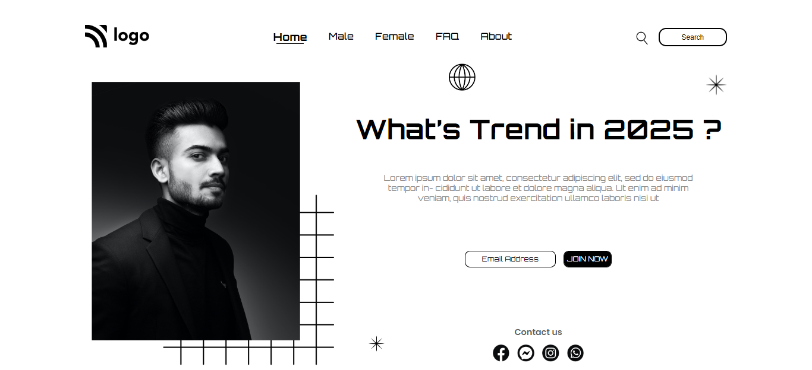

## INeuron Project -1

## Street Style Landing page

### In this project- Learnt :
- How to use selectors
- How to effectively use `position: absolute` property.
- Flexbox to make navbar.

### Time Spent:
Though relatively easy project, this being the first one it took nearly 5hours to complete.

### [Live Link](https://ineuron-proj-01-vivek.netlify.app/)

### QuickLook
 